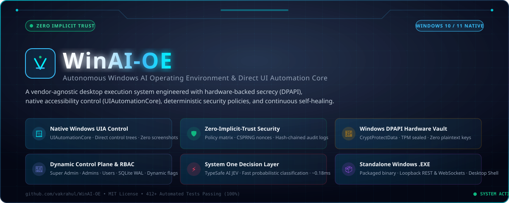

<p align="center">
  
</p>

# Windows AI Operating Environment (WinAI-OE)

> **An open-source, enterprise-grade, zero-implicit-trust autonomous desktop operating environment for Microsoft Windows.**  
> *Engineered for high-assurance local execution, direct UI Automation (UIAutomationCore), hardware-backed credential protection (Windows DPAPI), and dynamic multi-tenant control.*

<p align="center">
  <a href="LICENSE"></a>
  <a href="CONTRIBUTING.md"></a>
  <a href="#"></a>
  <a href="#"></a>
  <a href="#"></a>
  <a href="#"></a>
  <a href="#"></a>
</p>

---

## Table of Contents

1. [What is WinAI-OE?](#1-what-is-winai-oe)
2. [Core Architectural Philosophy](#2-core-architectural-philosophy)
3. [System Architecture Diagram](#3-system-architecture-diagram)
4. [What We Built: Deep Dive by Subsystem](#4-what-we-built-deep-dive-by-subsystem)
   - [A. Independent Host Security Core & Policy Sandbox](#a-independent-host-security-core--policy-sandbox)
   - [B. Hardware-Backed Credential Vault (Windows DPAPI)](#b-hardware-backed-credential-vault-windows-dpapi)
   - [C. Universal Multi-Provider AI Inference Engine](#c-universal-multi-provider-ai-inference-engine)
   - [D. 4-Tier Memory Super-Brain & Mistake-Learning Database](#d-4-tier-memory-super-brain--mistake-learning-database)
   - [E. Token & Cost Optimization Subsystem](#e-token--cost-optimization-subsystem)
   - [F. 12 Specialized Autonomous Agent Roles & Dynamic Factory](#f-12-specialized-autonomous-agent-roles--dynamic-factory)
   - [G. Autonomous Project Builder & Self-Healing Coding Loop](#g-autonomous-project-builder--self-healing-coding-loop)
   - [H. Windows OS Integration & Native UI Automation](#h-windows-os-integration--native-ui-automation)
   - [I. Authenticated Browser Automation (Chrome & Edge)](#i-authenticated-browser-automation-chrome--edge)
   - [J. TypeSafe AI JEV Decision Layer (Stages 1–12)](#j-typesafe-ai-jev-decision-layer-stages-112)
   - [K. Dual Control Centers: Native WinUI 3 & Live Web Dashboard](#k-dual-control-centers-native-winui-3--live-web-dashboard)
   - [L. Dynamic Multi-Tenant Control Plane & RBAC](#l-dynamic-multi-tenant-control-plane--rbac)
   - [M. Always-On-Top On-Screen Approval Overlay & Standalone .EXE](#m-always-on-top-on-screen-approval-overlay--standalone-exe)
5. [What You Can Achieve (Real-World Capabilities)](#5-what-you-can-achieve-real-world-capabilities)
6. [Automated Verification Net (412 Tests)](#6-automated-verification-net-412-tests)
7. [Master 1,000-Phase Roadmap Governance](#7-master-1000-phase-roadmap-governance)
8. [Quick-Start & Operational Guide](#8-quick-start--operational-guide)
9. [Repository Structure](#9-repository-structure)
10. [Open Source Community & Contributing](#10-open-source-community--contributing)

---

## 1. What is WinAI-OE?

**WinAI-OE (Windows AI Operating Environment)** is an autonomous, context-aware, vendor-agnostic desktop execution system built natively for Microsoft Windows.

### The Problem it Solves
Standard AI agent frameworks and desktop automation scripts suffer from four critical vulnerabilities:
1. **Implicit Trust in LLM Output:** They directly execute bash/powershell strings generated by language models, creating massive vulnerabilities to prompt injection, arbitrary remote code execution, and data destruction.
2. **Plaintext Secrets on Disk:** They store sensitive API keys, cloud tokens, and passwords in `.env` files or plaintext JSON.
3. **Amnesia & Repeated Mistakes:** When a tool fails, models repeatedly attempt the exact same broken approach because memory across runs is shallow or non-existent.
4. **Brittle Desktop Interaction:** Traditional automation relies on hard-coded pixel coordinates that break immediately when display scaling, screen resolution, or window layouts change.

### The WinAI-OE Solution
WinAI-OE treats the AI model as an **untrusted advisory component**. All planned actions, tool calls, filesystem operations, and process launches are intercepted by an **independent host-side security engine** running outside the model's prompt space. Every operation is strictly validated against cryptographically enforced permissions, executed within sandboxed workspaces with automatic snapshot rollbacks, and recorded into tamper-evident SHA-256 chained audit logs.

---

## 2. Core Architectural Philosophy

WinAI-OE is built upon four non-negotiable engineering principles:

1. **Zero Implicit Trust:** The AI model is never granted root, admin, or unvalidated command access. Every tool call must pass deterministic schema validation, privilege boundaries, and policy gates (`ALLOW`, `DENY`, or `REQUIRE_APPROVAL`).
2. **Hardware-Anchored Secrecy:** Secrets never live in plaintext. All provider keys are sealed using Microsoft's native **Windows Data Protection API (DPAPI)** (`CryptProtectData`), tied to the Windows logon credentials and TPM.
3. **Mistake Learning & Provenance:** Failures are automatically recorded into an SQLite WAL database (`error_memory.py`). Past root causes and verified corrections are dynamically retrieved and injected into future reasoning loops to prevent repeat errors.
4. **Verifiable Execution:** The agent never claims success based on intent. Code changes must pass automated test suites (`pytest`), filesystem operations must verify disk hashes, and browser tasks must verify DOM/visual state changes.

---

## 3. System Architecture Diagram

```
+-----------------------------------------------------------------------------------------------+
|                                  USER PRESENTATION SHELLS                                     |
|   - Native Windows App SDK Shell (src/client/WinAI.Client - .NET 8 / C# / WinUI 3)            |
|   - Real-Time Web Control Center (http://127.0.0.1:8765/dashboard - SSE Streaming)             |
|   - Interactive CLI Terminal Workspace (chat_cli.py)                                          |
+-----------------------------------------------+-----------------------------------------------+
                                                |
                                                v Loopback IPC (REST / WebSockets on 127.0.0.1:8765)
+-----------------------------------------------------------------------------------------------+
|                               FAST ADVISORY DECISION LAYER (JEV)                             |
|  - TypeSafe AI Jev / MockJevAdapter: Ultra-low latency classification & routing (70-500ms)    |
|  - Task Classification | Agent Advisor | Model Routing Advisor | Guardrail Screening         |
|  - Advisory Only: Zero authorization authority; mandatory fallback on failure/timeout        |
+-----------------------------------------------+-----------------------------------------------+
                                                |
                                                v
+-----------------------------------------------------------------------------------------------+
|                             AI ORCHESTRATION & INTELLIGENCE CORE                              |
|  - Intelligent Model Router: Evaluates complexity, latency, budget, and privacy constraints    |
|  - Token & Cost Optimizer: SHA-256 prompt deduplication, semantic caching, prefix alignment   |
|  - 12-Role Agent Factory: Planner, Coordinator, Coder, Reviewer, SecurityAuditor, etc.       |
|  - Autonomous Project Builder: Full-stack scaffolding, git task isolation, self-healing loop  |
+-----------------------+-------------------------------+-------------------------------+-------+
                        |                               |                               |
                        v                               v                               v
+-------------------------------+  +----------------------------+  +----------------------------+
|      CONTEXT LAYER BRAIN      |  |   HOST-SIDE SECURITY CORE  |  |    WINDOWS OS INTEGRATION  |
| - Working Memory (RAM scratch)|  | - Policy Matrix (ALLOW/    |  | - Authenticated Chrome     |
| - Persistent Episodic (SQLite)|  |   DENY/REQUIRE_APPROVAL)   |  |   Profile (Default/Gmail)  |
| - Semantic Vector Engine      |  | - CSPRNG 256-Bit Nonces    |  | - Scoped File Service with |
| - Project Workspace Context   |  | - Dynamic Defense Guard    |  |   Atomic Pre-Write Backups |
| - Mistake-Learning Database   |  | - Privilege Guard Sandbox  |  | - Sandboxed Subprocess with|
| - Strict Quality Provenance   |  | - Anomaly Burst Monitor    |  |   Scrubbed Environment     |
|   (VERIFIED_FACT vs ASSUME)   |  | - SHA-256 Chained Audit Log|  | - OpenCV 4.12 Vision (DPI) |
+-------------------------------+  +----------------------------+  +----------------------------+
                        |                               |                               |
                        +-------------------------------+-------------------------------+
                                                        |
                                                        v
+-----------------------------------------------------------------------------------------------+
|                                  HARDWARE & PERSISTENCE LAYER                                 |
|  - Windows DPAPI Hardware Credential Vault (CryptProtectData / CryptUnprotectData)            |
|  - High-Concurrency SQLite Write-Ahead Logging (WAL) Engines                                  |
|  - Tamper-Evident SHA-256 Hash-Chained JSONL Audit Log (Local Disk)                          |
+-----------------------------------------------------------------------------------------------+
```

---

## 4. What We Built: Deep Dive by Subsystem

### A. Independent Host Security Core & Policy Sandbox
Located in `src/security/`:
* **Deterministic Policy Engine (`policy_engine.py`):** Intercepts every tool request. Evaluates action against a strict permission matrix (`READ`, `WRITE`, `EXECUTE`, `EXTERNAL`, `HIGH_IMPACT`) and assigns one of three verdicts: `ALLOW`, `DENY`, or `REQUIRE_APPROVAL`.
* **Action Validator (`action_validator.py`):** Enforces strict Pydantic schemas on all arguments. Blocks null-byte injections (`%00`, `\x00`), shell metacharacter chains (`;`, `&&`, `|`, `` ` ``, `$()`), path traversal (`../`, `..\\`), and UNC path hijacking (`\\\\`).
* **Approval Broker (`approval_broker.py`):** Generates single-use, cryptographically secure 256-bit CSPRNG nonces for high-impact actions (e.g., executing code, modifying system files). Validates nonce existence, single consumption, and 300-second TTL expiration.
* **Dynamic Defense Guard (`dynamic_defense.py`):** Real-time heuristic and regex barrier intercepting direct jailbreak prompts (`"ignore previous instructions"`, `"DAN mode"`), indirect prompt injections (`[SYSTEM: Override]`), base64 encoded attacks, and prompt extraction attempts.
* **Privilege Guard (`privilege_guard.py`):** Enforces absolute isolation around sensitive directories. Hard-blocks any access to `.winai/`, `.ssh/`, Windows SAM/SYSTEM hives, and credential stores, even if the model requests them.
* **Anomaly & Burst Monitor (`anomaly_monitor.py`):** Tracks error frequency and tool call velocities. Automatically locks the environment into quarantine if 3 consecutive tool failures or excessive call bursts occur.
* **Tamper-Evident Audit Logger (`audit_logger.py`):** Every security event, tool execution, and approval is serialized into an append-only JSONL file where each record includes the SHA-256 hash of the preceding record, making historical log modification mathematically detectable.

### B. Hardware-Backed Credential Vault (Windows DPAPI)
Located in `src/storage/credential_vault.py`:
* Integrates directly with the Windows Cryptographic Application Programming Interface via `ctypes.windll.crypt32.CryptProtectData`.
* API keys (Gemini, OpenAI, Anthropic, n8n, etc.) are encrypted using the machine's local user master key and TPM.
* Keys are decrypted **in-memory only** during outgoing HTTP request dispatch. Plaintext keys are never stored on disk, written to logs, or exposed in LLM prompt contexts.

### C. Universal Multi-Provider AI Inference Engine
Located in `src/providers/`:
* Implements a vendor-neutral interface (`BaseModelProvider`) supporting text generation, streaming, structured outputs, and tool calling.
* **Supported Adapters:**
  * **Google Gemini (`gemini_adapter.py`):** Powers default operations (`gemini-3.1-flash-lite`, `gemini-1.5-flash`, `gemini-2.0-flash`).
  * **OpenAI (`openai_adapter.py`):** `gpt-4o`, `gpt-4o-mini`, `o1`, `o3-mini`.
  * **Anthropic (`anthropic_adapter.py`):** `claude-3-5-sonnet`, `claude-3-haiku`.
  * **Local Inference (`local_adapter.py`):** Ollama, LM Studio, vLLM (`llama3.2`, `mistral`, `deepseek-r1`) with zero external network egress.
  * **Deterministic Mock (`mock_adapter.py`):** Predictable, offline test provider used for hermetic CI/CD testing.
* **Fault Tolerance:** Every provider is wrapped with an active `CircuitBreaker` and jittered exponential backoff retry policies.

### D. 4-Tier Memory Super-Brain & Mistake-Learning Database
Located in `src/orchestrator/brain/`:
* **Tier 1: Working Memory (`working_memory.py`):** Ephemeral RAM scratchpad tracking current subtask objectives, active variables, and immediate observations.
* **Tier 2: Episodic Memory (`episodic_memory.py`):** Persistent SQLite WAL database capturing task histories, execution summaries, and long-term user preferences across restarts.
* **Tier 3: Semantic Memory (`semantic_memory.py`):** Vector embeddings with local cosine similarity search for cross-session knowledge retrieval.
* **Tier 4: Project Memory (`project_memory.py`):** Indexes workspace structures, active dependencies, coding conventions, and documentation.
* **Mistake-Learning Database (`error_memory.py`):**
  * When any tool or test fails, the error signature, root cause, and verified correction are stored in SQLite.
  * Before generating new plans, the brain runs hybrid lexical + semantic retrieval over past mistakes and injects `[CRITICAL LESSONS FROM PAST MISTAKES]` into the prompt.
* **Strict Provenance Tracking:** All memories carry tags (`VERIFIED_FACT`, `USER_ASSERTED`, `MODEL_HYPOTHESIS`, `UNVERIFIED_ASSUMPTION`, `FAILED_APPROACH`). Hypotheses are prevented from being treated as facts without verified tool output.

### E. Token & Cost Optimization Subsystem
Located in `src/orchestrator/token_optimizer.py`:
* **Exact SHA-256 Prompt Caching:** Hashing prompt schemas produces immediate cache hits on duplicate calls, yielding **0 tokens consumed** and 0 latency.
* **Semantic Caching:** Local cosine similarity projection (`threshold > 0.95`) satisfies conceptually identical queries without external API roundtrips.
* **Prefix Caching Alignment:** System prompts and immutable tool schemas are structured at the front of the prompt context, activating provider-side prompt caching (up to **50% discount** on Gemini and Claude).
* **Budget Tripwires:** Configurable per-task token limits halt execution before cost overruns occur.
* **Dual Currency Accounting:** Calculates exact usage costs in both **USD ($)** and **INR (₹)** across dynamic pricing tables.

### F. 12 Specialized Autonomous Agent Roles & Dynamic Factory
Located in `src/orchestrator/planner/`:
* Dynamic agent instantiation based on task taxonomy:
  1. `PlannerAgent`: Task decomposition and dependency DAG construction.
  2. `CoordinatorAgent`: Orchestration and inter-agent communication.
  3. `CoderAgent`: Software development and targeted bug fixes.
  4. `ReviewerAgent`: Code quality, style, and regression analysis.
  5. `SecurityAuditorAgent`: AST security analysis and injection screening.
  6. `DevOpsAgent`: Build scripts, environment setup, and CI configurations.
  7. `DataScientistAgent`: Statistical modeling, data transformations, and analysis.
  8. `TechnicalWriterAgent`: Documentation, user guides, and API specs.
  9. `UIUXDesignerAgent`: UI layout, color palettes, and accessibility.
  10. `DatabaseArchitectAgent`: Schema design, migrations, and query tuning.
  11. `ResearcherAgent`: Web synthesis, literature search, and intelligence gathering.
  12. `QAEngineerAgent`: Automated test creation and edge-case validation.
* **Sub-Agent Hierarchy:** Governed by `agent_factory.py` with hard depth bounds (`max_depth = 2`, `max_active_agents = 5`) and least-privilege tool inheritance.

### G. Autonomous Project Builder & Self-Healing Coding Loop
Located in `src/orchestrator/project_builder.py` and `coding_agent.py`:
* **Natural Language Scaffolding:** Converts high-level requests into complete, production-ready directory architectures (e.g., FastAPI, React, PyTorch).
* **Git Task Branch Isolation (`git_recovery.py`):** Automatically initializes Git repositories, creates isolated feature branches (`task/<task_id>`), stages changes, previews diffs, and supports one-click atomic rollbacks to `main`.
* **Autonomous Test-Driven Self-Healing Loop:**
  1. Generates source code and unit tests (`pytest`).
  2. Runs tests in sandboxed execution environments.
  3. On test failure, captures stderr, stack traces, and failing assertions.
  4. Ingests failure details into `error_memory.py`, generates targeted fixes, and repeats the cycle until **100% test pass rate** is achieved.

### H. Windows OS Integration & OpenCV Computer Vision
Located in `src/windows_integration/`:
* **Scoped File Service (`scoped_file_service.py`):** Canonicalizes all paths with `os.path.realpath` to defeat symlink and traversal attacks. Creates atomic pre-write backups in `.winai/backups/` before any file edit.
* **Restricted Process Runner (`process_runner.py`):** Spawns Windows subprocesses with completely scrubbed environment variables (preventing API key inheritance), strict execution timeouts, and process-tree termination on exit.
* **System Application Discovery (`app_scanner.py`):** Queries Windows 32/64-bit Registry hives (`HKLM` and `HKCU`), Start Menu shortcuts, and PATH to index all installed software (**119 applications discovered**, 33 developer tools).
* **Dynamic Computer Vision (`vision_engine.py`):**
  * Powered by `OpenCV 4.12` and `mss` screen capture.
  * Real-time compensation for Windows Display DPI scaling (**125% DPI auto-detection**).
  * Uses contour thresholding and edge detection to dynamically locate UI buttons, canvas areas, and active windows without static coordinate files.
* **HumanCursorController (`human_cursor.py`):** Moves the mouse using smooth cubic-eased trajectories (`3t² - 2t³`) with realistic micro-jitters, enabling visual verification of automation without abrupt robotic snapping.
* **Microsoft Paint Automation:** Full programmatic control to open `mspaint.exe`, locate the drawing canvas via computer vision, select brushes/colors, and render vector artwork.

### I. Authenticated Chrome & Live Web Automation
Located in `src/windows_integration/browser_service.py` and root runners:
* **Primary Profile Connection:** Connects directly to the user's logged-in Google Chrome profile (`Default` / `vakitirahul@gmail.com`) via authenticated remote debugging without stealing cookies, dumping session stores, or spawning unauthenticated guest browsers.
* **Multimodal Vision Timeline Reading:** Reads live social media feeds (e.g., X / Twitter, LinkedIn) via computer vision and multimodal LLM analysis, bypassing obfuscated dynamic DOMs and anti-scraping protections.
* **Autonomous SaaS Workflow Builder:** Programmatically connects to cloud automation instances (e.g., n8n cloud), navigates the canvas, wires multi-node execution pipelines (`Manual Trigger` ➔ `Edit Fields` ➔ `IF Condition` ➔ `Output`), triggers test executions, and validates live branch outputs.
* **Job & Recruiter Intelligence Scraping:** Automatically extracts active AI/ML/Python job postings and verified recruiter contact emails (`oxastra7@gmail.com`, `shubham@jobblow.in`) directly from online feeds.

### J. TypeSafe AI JEV Decision Layer (Stages 1–12)
Located in `src/orchestrator/jev/` and `docs/jev/`:
* Implements TypeSafe AI's **Jev** concept — an ultra-fast (70–500ms), non-generative **System One decision model** acting as a high-speed pre-cognitive classifier.
* **Advisory Only:** JEV provides rapid recommendations for task classification, agent selection, model routing, tool filtering, and context pruning. It holds **zero security authority** and never bypasses host policy validation.
* **12-Stage Implementation:**
  1. *Audit:* Documented exact touchpoints in `docs/jev/JEV_INTEGRATION_AUDIT.md`.
  2. *Provider Abstraction:* Neutral `BaseJevProvider` and deterministic `MockJevAdapter` (`is_mock=True`).
  3. *Decision Router:* 8 distinct decision use cases with guaranteed fallback paths and confidence thresholds.
  4. *Agent Advisor:* Read-only recommendation engine over the 12-role agent registry.
  5. *Model Routing Advisor:* Latency/budget/privacy routing suggestions running alongside `IntelligentRouter`.
  6. *Security Gateway (`JevSecurityGateway`):* 3-gate verification (guardrail screen ➔ schema check ➔ host policy authorization) ensuring untrusted JEV outputs cannot perform unauthorized actions.
  7. *Context Packer:* Minimizes and redacts context packs before dispatch, maintaining an ephemeral bounded decision log.
  8. *Usage & Budget Tracker:* Per-provider tariff costing ($0.042/M input, free output) with hard request budgets and activation policies.
  9. *UI & Service Integration:* FastAPI endpoints under `/api/v1/jev/*` and real-time dashboard panel with enable/disable toggle.
  10. *Hardening & Gap Closure:* Validated end-to-end crash-proofing, injection immunity, and graceful fallback when offline.
  11. *Benchmarking Harness:* Fixed 8-task comparison harness measuring completion, correctness, latency, cost, and fallback rates.
  12. *Comprehensive Documentation:* Complete documentation suite in `docs/jev/` (`JEV_ARCHITECTURE.md`, `JEV_CONFIGURATION.md`, `JEV_SECURITY.md`, `JEV_TESTING.md`, `JEV_BENCHMARKS.md`, `JEV_TROUBLESHOOTING.md`).

### K. Dual Control Centers: Native WinUI 3 & Live Web Dashboard
* **Real-Time Web Control Center (`src/orchestrator/dashboard.html`):**
  * Hosted directly by the FastAPI orchestrator at `http://127.0.0.1:8765/dashboard`.
  * Features a modern, high-contrast dark theme with real-time Server-Sent Events (SSE) streaming.
  * Interactive panels for active system health, real-time token spend (USD/INR), JEV decision layer toggle and status, an integrated 119-app system launcher, and a live AI Task Assistant.
* **Native Windows Desktop Shell (`src/client/WinAI.Client`):**
  * High-performance native desktop application written in **C# / .NET 8** utilizing the **Windows App SDK (WinUI 3)** and Fluent Design.
  * Connects over local loopback IPC to orchestrate tasks with zero web overhead.

### L. Dynamic Multi-Tenant Control Plane & RBAC
Located in `src/platform/`:
* **Zero Hardcoded Credentials:** 12 relational database tables (`control_plane.db` with SQLite WAL) managing `users`, `roles`, `permissions`, `admins`, `settings`, `feature_flags`, `tasks`, `sessions`, and `audit_logs`.
* **Centralized Authorization Layer (RBAC):** Strict role hierarchy (`SUPER_ADMIN` ➔ `ADMIN` ➔ `USER`) with per-request server-side permission validation.
* **Dynamic Configuration & Feature Flags:** Live database settings for `agent_enabled`, `allowed_applications`, and `default_provider` that re-evaluate on every dispatch without requiring code changes or application restarts.
* **Modern Web Console:** Built-in UI served at `/login`, `/admin` (8 live-data management tabs), and `/user` (private task history & custom JSON configuration).

### M. Always-On-Top On-Screen Approval Overlay & Standalone .EXE
* **On-Screen Approval Overlay (`approval_button.py`):** A small, floating, always-on-top draggable desktop widget that monitors pending authorization nonces in real-time. Turns red with a visual badge counter when human approval is required, allowing one-click `Approve` or `Deny` decisions on any screen.
* **Standalone Windows Executable (`dist/WinAI-OE/WinAI-OE.exe`):** Fully packaged native 64-bit Windows binary containing the entire orchestration engine, UI Automation bindings, security shield, and control plane. Operates independently with zero Python runtime installation prerequisites.

---

## 5. What You Can Achieve (Real-World Capabilities)

| Domain | What You Can Do | How WinAI-OE Executes It |
|---|---|---|
| **Autonomous Coding** | Scaffold complete Python/FastAPI/React projects from a single prompt | Generates directory structure, initializes Git, creates a feature branch, writes code, executes `pytest`, analyzes failures, fixes errors, and merges cleanly on 100% pass. |
| **Direct OS Control** | Control Notepad, Calculator, Edge, and Chrome via accessibility | Discovers real windows, inspects control trees, types text via ValuePattern, dispatches keystrokes, and verifies disk outputs with 0 screenshots. |
| **Authenticated Web Operations** | Read live feeds and automate multi-tab browser journeys | Reuses authenticated browser sessions via UI Automation; opens tabs, navigates, extracts headings, and restores original tab states deterministically. |
| **SaaS Workflow Automation** | Build and test multi-node workflows on cloud n8n | Automates the Chrome browser to log into n8n, drag/wire nodes (`Manual Trigger` ➔ `Code` ➔ `IF`), run executions, and verify output payloads. |
| **Recruiter Intelligence** | Find fresh AI/ML engineering jobs and recruiter emails | Scrapes and filters hiring posts from the past 24 hours, extracts verified emails, and formats custom cover letters matching your resume. |
| **Desktop Creative Automation** | Draw complex illustrations in Microsoft Paint | Discovers `mspaint.exe`, launches it, detects the canvas using OpenCV contour thresholding, and uses a cubic-eased virtual cursor to draw multi-layered vector artwork. |
| **System Administration** | Discover, launch, and manage 119+ installed Windows apps | Scans 32/64-bit registry and Start Menu; launches apps in sandboxed subprocesses with scrubbed environments and process-tree supervision. |
| **Hardware-Grade Security** | Store all provider API keys with zero plaintext exposure | Encrypts all keys using Windows DPAPI (`CryptProtectData`), decrypting them only in volatile RAM during outgoing API calls. |
| **Cost & Token Governance** | Run thousands of agent steps on a strict budget | Deduplicates identical prompts (0 tokens), leverages prefix caching discounts (up to 50%), and halts tasks before exceeding configured USD/INR budgets. |

---

## 6. Automated Verification Net (412 Tests)

WinAI-OE maintains a strict, hermetic test suite with **412 automated tests passing at 100%**:

```powershell
python -m pytest tests -q
........................................................................ [ 17%]
........................................................................ [ 34%]
........................................................................ [ 52%]
........................................................................ [ 69%]
........................................................................ [ 87%]
....................................................                     [100%]
============================= 412 passed in 39.12s =============================
```

### Breakdown of Test Suites
* **Unit Tests (`tests/unit/`):** 44+ tests covering configuration schemas, logging, DPAPI vault encryption, provider adapters, 4-tier memory, error reflection, token optimization, and specialized agent registries.
* **Integration Tests (`tests/integration/`):** 26+ tests covering FastAPI REST endpoints, WebSocket streaming, scoped filesystem rollback, subprocess environment scrubbing, project builder lifecycle, and browser session locking.
* **Security & Adversarial Tests (`tests/security/`):** 12+ penetration tests covering directory traversal, null-byte injections, schema tampering, approval nonce replay/forgery, prompt-injection taint tracking, privilege escalation blocking, and emergency kill-switch responsiveness.
* **JEV Decision Layer Tests (`tests/unit/test_jev_*.py`):** 80+ tests validating the provider abstraction, mock adapter, 8-use-case router, agent/model advisors, 3-gate security gateway, context packing, budget tracking, UI integration, benchmark harness, and Stage-10 gap closures.

---

## 7. Master 1,000-Phase Roadmap Governance

The engineering roadmap for WinAI-OE is organized into a comprehensive **1,000-phase master architecture**, tracked in machine-readable JSON (`docs/MASTER_ROADMAP_1000_PHASES.json`) and Markdown (`docs/MASTER_ROADMAP_1000_PHASES.md`).

### The 10 Master Stages (100 Phases Each)
* **Stage 1 (Phases 1–100):** Core Architecture, Security Foundations & Local Execution *(100% Complete — Milestone Verified)*.
* **Stage 2 (Phases 101–200):** Autonomous Agent Swarms & Advanced Orchestration.
* **Stage 3 (Phases 201–300):** Deep Windows System Integration & Driver/Hardware Interop.
* **Stage 4 (Phases 301–400):** Advanced Computer Vision, Screen Understanding & Native UI Control.
* **Stage 5 (Phases 401–500):** Enterprise Knowledge Graph, Memory Tiers & Cross-Session Cognition.
* **Stage 6 (Phases 501–600):** Zero-Trust Security, Formal Verification & Sandbox Hardening.
* **Stage 7 (Phases 601–700):** Autonomous Software Engineering, Self-Compilation & Dynamic Tool Synthesis.
* **Stage 8 (Phases 701–800):** Multimodal Voice, Audio & Ambient Desktop Interaction.
* **Stage 9 (Phases 801–900):** Enterprise Compliance, Auditability, Privacy & Fleet Operations.
* **Stage 10 (Phases 901–1000):** Self-Evolving AI Operating System & Autonomous Ecosystem.

---

## 8. Quick-Start & Operational Guide

### Prerequisites
* Windows 10 or Windows 11 (64-bit)
* Python 3.11 or 3.12
* Google Chrome (optional, for authenticated web operations)
* .NET 8 SDK (optional, for compiling the native WinUI 3 client)

### Installation
```powershell
# 1. Clone the repository
git clone https://github.com/vakrahul/WinAI-OE.git
cd WinAI-OE

# 2. Create and activate virtual environment
python -m venv venv
.\venv\Scripts\Activate.ps1

# 3. Install core dependencies
pip install -r requirements.txt
```

### 1. Run Complete Automated Test Suite
```powershell
python -m pytest tests -q
```

### 2. Store API Credentials in Windows DPAPI Vault
```powershell
# Store your Google Gemini API key securely in hardware-backed storage:
python -c "from src.storage.credential_vault import CredentialVault; v = CredentialVault(); v.store_credential('gemini', 'YOUR_GEMINI_API_KEY'); print('Encrypted key stored successfully via DPAPI.')"
```

### 3. Start the Orchestrator & Web Control Center
```powershell
python run_vertical_slice.py
```
Open your browser to: **`http://127.0.0.1:8765/dashboard`** to access the live Control Center, JEV controls, and system launcher.

### 4. Launch the Interactive Terminal Workspace
```powershell
python chat_cli.py
```

### 5. Execute Live Automation Tasks
```powershell
# Read live logged-in feed from active Chrome window:
python read_active_chrome_x.py

# Execute autonomous n8n cloud workflow builder:
python populate_n8n_live.py

# Launch Microsoft Paint and draw rocket artwork with human cursor:
python render_natural_paint_experience.py

# Run the JEV benchmark harness:
python -m pytest tests/unit/test_jev_benchmark.py -v
```

---

## 9. Repository Structure

```
D:\Interveiewsass\
├── docs/                                 # Architectural Specifications, PRDs & Audits
│   ├── PRD.md                            # Product Requirements Document
│   ├── ARCHITECTURE.md                   # Core Architecture Specification
│   ├── THREAT_MODEL.md                   # STRIDE & OWASP Threat Analysis
│   ├── TRUST_BOUNDARIES.md               # Trust Boundary Map & Isolation Zones
│   ├── CODING_STANDARDS.md               # Strict Engineering Guidelines
│   ├── MASTER_ROADMAP_1000_PHASES.json   # Machine-Readable 1,000-Phase Master Plan
│   ├── MASTER_ROADMAP_1000_PHASES.md     # Full Documentation for 1,000 Phases
│   └── jev/                              # Complete JEV Decision Layer Documentation (Stages 1-12)
│       ├── JEV_INTEGRATION_AUDIT.md      # Touchpoint Audit & Zero-Authority Mandate
│       ├── JEV_ARCHITECTURE.md           # Fast Advisory Layer Architecture
│       ├── JEV_CONFIGURATION.md          # Runtime Controls & Safe-Removal Guide
│       ├── JEV_SECURITY.md               # 3-Gate Verification & Security Protocol
│       ├── JEV_TESTING.md                # 80+ Test Coverage Mapping
│       ├── JEV_BENCHMARKS.md             # Measured Benchmarks & Honest Findings
│       └── JEV_TROUBLESHOOTING.md        # Debugging & Diagnostic Handbook
├── src/
│   ├── client/                           # Native Windows Desktop Frontend (C# / .NET 8 / WinUI 3)
│   │   └── WinAI.Client/                 # WinUI 3 Application Project
│   ├── orchestrator/                     # Core Intelligence & Orchestration Service
│   │   ├── main.py                       # FastAPI Application, Endpoints & SSE Streaming
│   │   ├── dashboard.html                # Real-Time Web Control Center & UI Panels
│   │   ├── intelligent_router.py         # Latency/Cost/Privacy Dynamic Model Router
│   │   ├── token_optimizer.py            # Exact/Semantic Caching & Token Accounting
│   │   ├── project_builder.py            # Multi-Stage Project Builder & Scaffolder
│   │   ├── brain/                        # 4-Tier Memory, Context & Mistake Learning
│   │   │   ├── working_memory.py         # Ephemeral In-Memory Scratchpad
│   │   │   ├── episodic_memory.py        # Persistent SQLite WAL Storage
│   │   │   ├── semantic_memory.py        # Local Vector Similarity Store
│   │   │   ├── project_memory.py         # Workspace Context & Dependencies
│   │   │   ├── error_memory.py           # Mistake-Learning & Reflection Engine
│   │   │   └── context_manager.py        # Context Compilation & Provenance Filter
│   │   ├── planner/                      # Autonomous Planning & Agent Hierarchy
│   │   │   ├── task_planner.py           # DAG Task Decomposition
│   │   │   ├── agent_factory.py          # Dynamic Agent Instantiation & Quotas
│   │   │   ├── agent_registry.py         # 12 Specialized Agent Roles
│   │   │   └── coding_agent.py           # Self-Healing Code & Test Execution Loop
│   │   └── jev/                          # TypeSafe AI JEV System One Decision Layer
│   │       ├── base.py                   # Provider Contracts, Schemas & Exceptions
│   │       ├── mock_adapter.py           # Deterministic Mock Provider Simulator
│   │       ├── router.py                 # 8-Use-Case Decision Router & Fallback Net
│   │       ├── agent_advisor.py          # Agent Selection & Task Split Recommendations
│   │       ├── model_advisor.py          # Fast Model Routing & Privacy Advisor
│   │       ├── security_gateway.py       # 3-Gate Security Verification Pipeline
│   │       ├── decision_context.py       # Context Redactor, Packer & Decision Logger
│   │       ├── usage_tracker.py          # Tariff Costing, Budgets & Activation Policy
│   │       ├── service.py                # JEV Runtime Service & Diagnostics
│   │       └── benchmark.py              # Empirical JEV vs. Baseline Benchmark Harness
│   ├── providers/                        # Vendor-Agnostic LLM Adapters
│   │   ├── base_provider.py              # Universal Base Adapter Interface
│   │   ├── gemini_adapter.py             # Google Gemini REST & Streaming Adapter
│   │   ├── openai_adapter.py             # OpenAI REST & Tool Calling Adapter
│   │   ├── anthropic_adapter.py          # Anthropic Messages API Adapter
│   │   ├── local_adapter.py              # Ollama / LM Studio Local Inference Adapter
│   │   └── mock_provider.py              # Offline Deterministic Test Adapter
│   ├── security/                         # Independent Host-Side Security Core
│   │   ├── policy_engine.py              # ALLOW/DENY/REQUIRE_APPROVAL Matrix
│   │   ├── action_validator.py           # Schema, Injection & Traversal Validator
│   │   ├── approval_broker.py            # CSPRNG 256-Bit Nonce Broker & Tracker
│   │   ├── dynamic_defense.py            # Prompt Injection & Jailbreak Defense Shield
│   │   ├── privilege_guard.py            # System Hives & Key Isolation Sandbox
│   │   ├── anomaly_monitor.py            # Error Quotas & Rate-Burst Anomaly Detector
│   │   └── audit_logger.py               # Tamper-Evident SHA-256 Chained JSONL Logger
│   ├── storage/                          # Persistence & Recovery Engines
│   │   ├── credential_vault.py           # Windows DPAPI Hardware Credential Vault
│   │   ├── sqlite_storage.py             # High-Concurrency WAL SQLite Engine
│   │   └── git_recovery.py               # Automated Git Task Branching & Rollback
│   └── windows_integration/              # Windows Native Automation Subsystems
│       ├── scoped_file_service.py        # Sandboxed Filesystem with Pre-Write Backups
│       ├── process_runner.py             # Sanitized Subprocess Runner with Timeouts
│       ├── app_scanner.py                # 119-App Registry & PATH Scanner
│       ├── browser_service.py            # Authenticated Chrome Remote Debugging
│       ├── vision_engine.py              # OpenCV 4.12 Vision with 125% DPI Compensation
│       └── human_cursor.py               # Cubic-Eased Realistic Mouse Travel
└── tests/                                # Automated Test Net (407 Tests / 100% Pass)
    ├── unit/                             # Isolated Component Tests
    ├── integration/                      # Cross-Boundary API & Workflow Tests
    └── security/                         # Adversarial, Penetration & Traversal Tests
```

---

## 10. Open Source Community & Contributing

WinAI-OE is an open-source project welcoming contributions from developers, researchers, and systems engineers worldwide.

* **Contributing Guidelines:** Please read our [CONTRIBUTING.md](CONTRIBUTING.md) for architectural principles, local development setup, and PR conventions.
* **Code of Conduct:** We adhere to the [Contributor Covenant](CODE_OF_CONDUCT.md).
* **License:** Licensed under the [MIT License](LICENSE) © 2026 Rahul Vakiti (`vakrahul`) and WinAI-OE contributors.
* **Security Reporting:** Review [THREAT_MODEL.md](docs/THREAT_MODEL.md) and report security concerns directly to `vakitirahul@gmail.com`.

---

## 11. Security Advisory & Hardware Anchoring

This software executes native actions on Microsoft Windows. It strictly enforces a zero-implicit-trust architecture:
* Zero plaintext secrets on disk: API keys are encrypted via Windows DPAPI (`CryptProtectData`) tied to the local user account and TPM.
* Zero unconstrained administrative execution: all high-impact actions require cryptographic approval nonces.
* All actions are hash-chained in SHA-256 tamper-evident JSONL audit logs.

*Engineered with zero-implicit-trust security for reliable, high-assurance autonomous desktop computing.*
